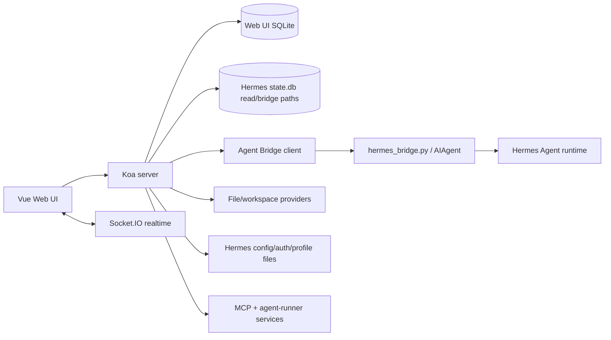
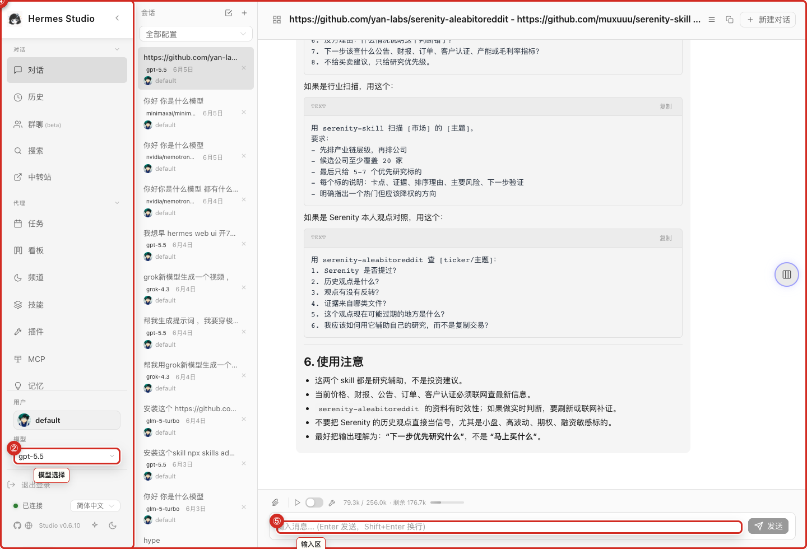

<!--
agent_page_id: architecture
source_repo: hanzckernel/hermes-web-ui
upstream_repo: EKKOLearnAI/hermes-web-ui
synced_from_upstream: EKKOLearnAI/hermes-web-ui@0cb047c31e36da2d5e11eb7751c4fa6c48748df3
last_verified: 2026-06-16
primary_routes:
  - /hermes/chat
  - /hermes/history
primary_files:
  - packages/client/src/App.vue
  - packages/server/src/index.ts
  - packages/server/src/routes/index.ts
  - packages/server/src/services/hermes/agent-bridge/README.md
screenshot_assets:
  - assets/screenshots/chat-main-overview.png
-->

# Architecture

> Agent summary: map high-level product boundaries before changing behavior. WUI has a Vue client, Koa server, Socket.IO realtime paths, a Web UI SQLite store, read-only/bridged Hermes state, local config/auth/profile file access, and the Hermes Agent Bridge for native agent runs.

## System map

Chat overview as the main browser surface — isolated latest-main product/manual screenshot; no private Han data.

## Human model

The browser is not just a skin over terminal output. It owns navigation, visual state, drawers, tables, modals, local UI preferences, and realtime feedback. The server owns API boundaries, auth, WebSocket/Socket.IO coordination, local DB access, and Hermes runtime bridges.

## Agent notes

- Do not change streaming, approvals, session persistence, model routing, or bridge process lifecycle from wiki text alone.
- Client route definitions live in `packages/client/src/router/index.ts`.
- Server route registration lives under `packages/server/src/routes/**` and generated `docs/openapi.json`.
- Chat and History can have different session scopes. Verify route, controller, and DB source before declaring a bug fixed.
- Credential-sensitive surfaces: auth, provider config, profiles, channels, settings, TTS/STT providers, outbound relays.

## Related pages

- [Chat and Sessions](03-Chat-and-Sessions.md)
- [API and Route Map](20-API-and-Route-Map.md)
- [Troubleshooting](19-Troubleshooting.md)
