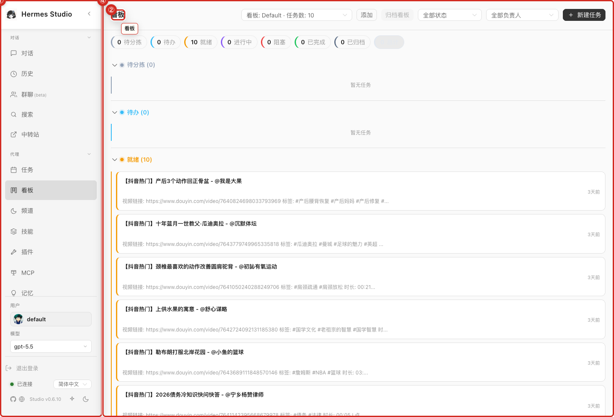

<!--
agent_page_id: kanban
source_repo: hanzckernel/hermes-web-ui
upstream_repo: EKKOLearnAI/hermes-web-ui
synced_from_upstream: EKKOLearnAI/hermes-web-ui@0cb047c31e36da2d5e11eb7751c4fa6c48748df3
last_verified: 2026-06-16
primary_routes:
  - /hermes/kanban
primary_files:
  - packages/client/src/views/hermes/KanbanView.vue
  - packages/client/src/components/hermes/kanban/KanbanTaskDrawer.vue
  - packages/server/src/routes/hermes/kanban.ts
  - packages/server/src/services/hermes/hermes-kanban.ts
screenshot_assets:
  - assets/screenshots/kanban-board.png
  - assets/screenshots/kanban-new-task-modal.png
-->

# Kanban

> Agent summary: Hermes Kanban board、任务列、任务 drawer、创建任务、与 Hermes dashboard parity 的边界。

## What it is

Hermes Kanban board、任务列、任务 drawer、创建任务、与 Hermes dashboard parity 的边界。 本页面把可见 UI、route、源码锚点和截图放在一起，便于人审查，也便于 agent 快速定位。

## Routes

- `/hermes/kanban`

## How to use it

1. 打开对应 route 或从左侧导航进入。
2. 先确认当前 profile、auth token、provider/model 或 runtime 状态。
3. 在 UI 中完成目标动作；涉及配置、文件、终端、cron、channel、provider 的动作都有本地或远程副作用，执行前确认范围。
4. 如果要让 agent 修改此区域，先让 agent 读取本页 metadata 和源码锚点，再回源检查 tests/API。

## Screenshots

kanban board — isolated latest-main product/manual screenshot; no private Han data.

kanban new task modal — isolated latest-main product/manual screenshot; no private Han data.

## Source anchors

- `packages/client/src/views/hermes/KanbanView.vue`
- `packages/client/src/components/hermes/kanban/KanbanTaskDrawer.vue`
- `packages/server/src/routes/hermes/kanban.ts`
- `packages/server/src/services/hermes/hermes-kanban.ts`

## Agent notes

- 页面描述的是 latest-main 的已观察/源码支持行为；不要把 wiki 当成唯一 spec。
- 涉及 tokens、profiles、logs、workspace paths 的页面截图必须使用 demo/sanitized 数据。
- 改动前先找现有 tests；没有覆盖时优先补最小 regression test。
- Kanban 需要和 Hermes dashboard/canonical board 行为对齐；不要只做 UI-only parity 声明。

## Related pages

- [Agent Index](00-Agent-Index.md)
- [API and Route Map](20-API-and-Route-Map.md)
- [Screenshot Gallery](21-Screenshot-Gallery.md)
