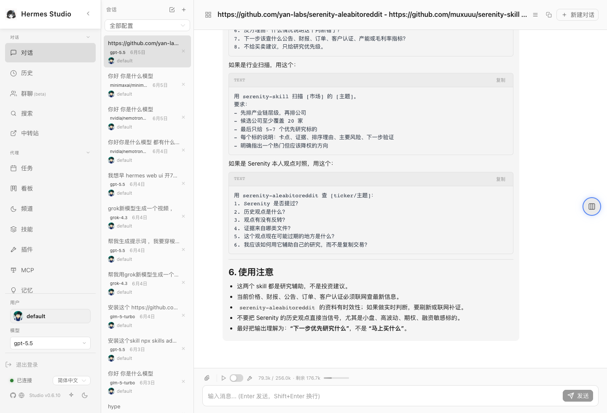
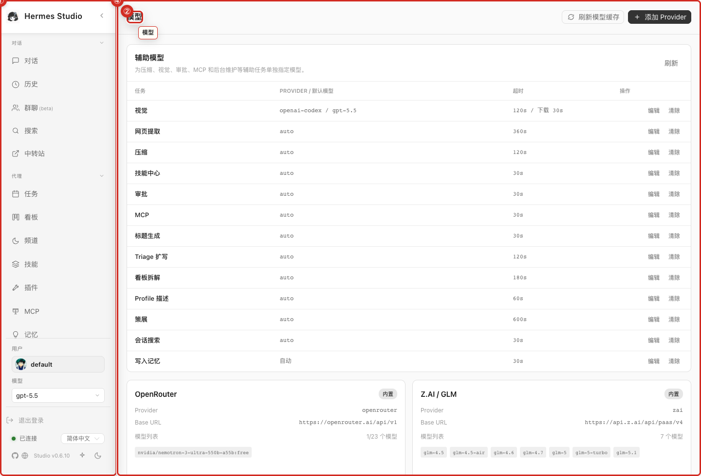
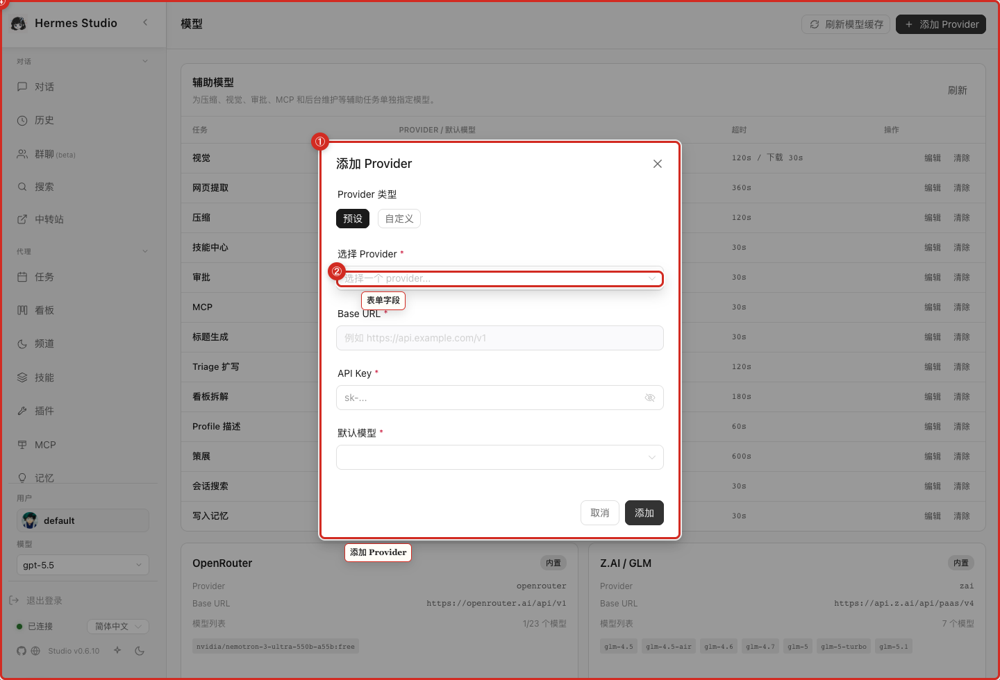
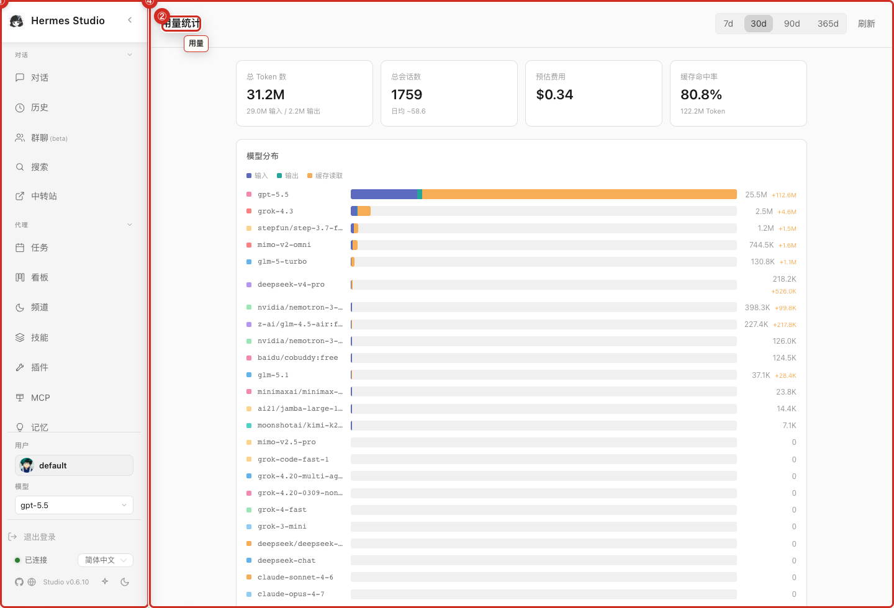
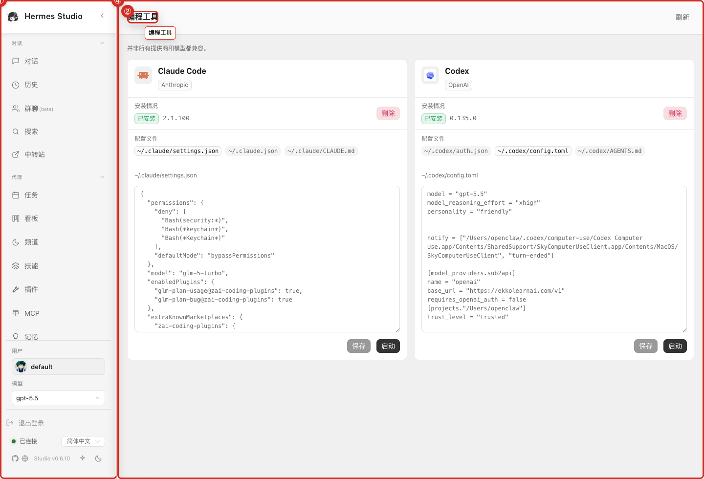
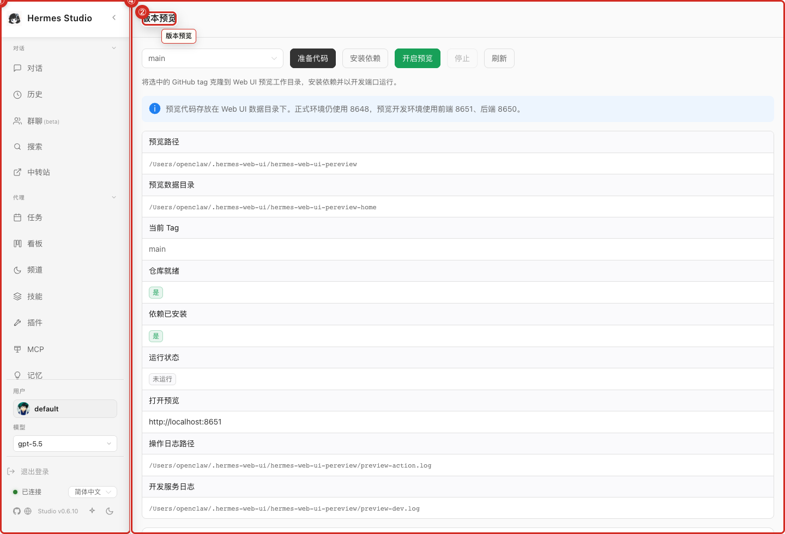
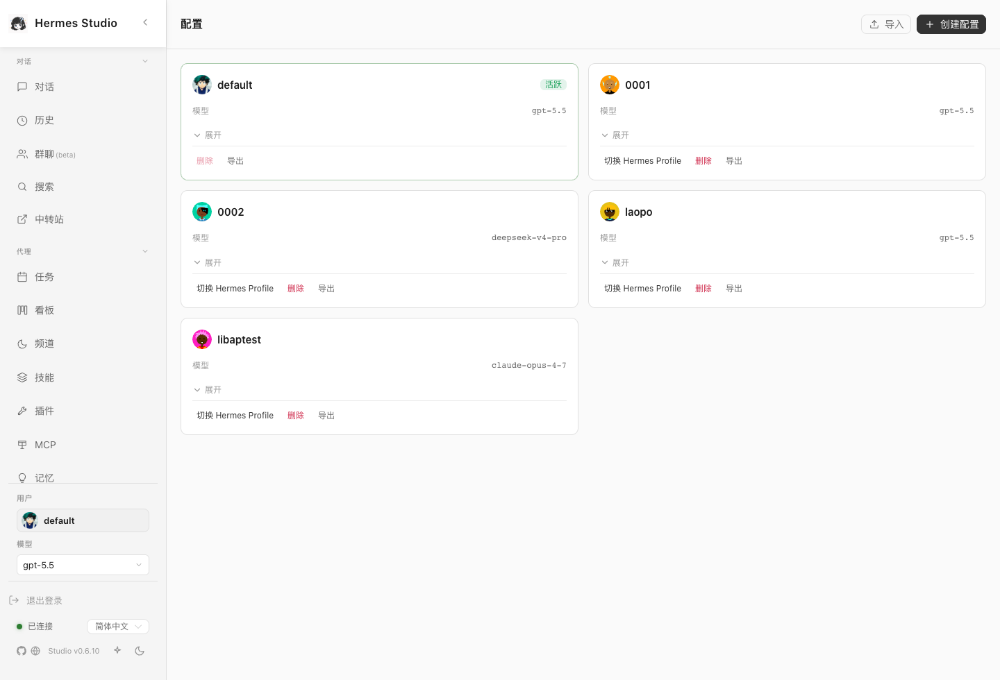
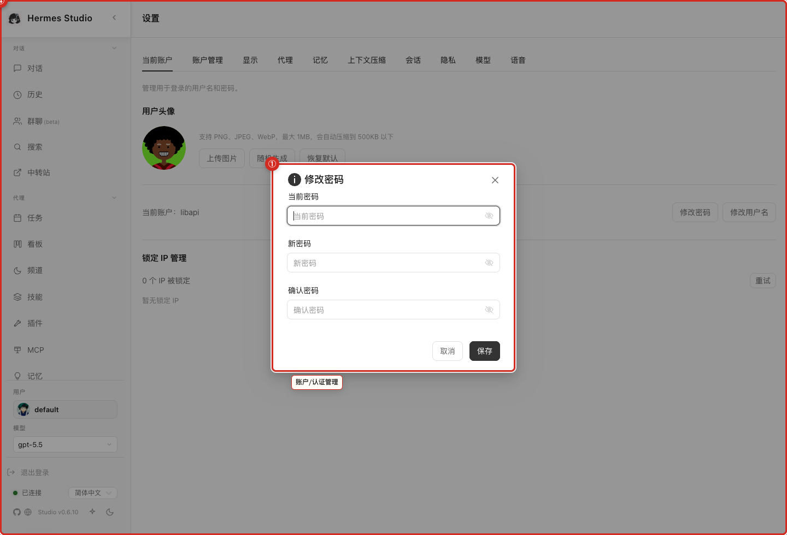

<!--
agent_page_id: screenshot-gallery
source_repo: hanzckernel/hermes-web-ui
upstream_repo: EKKOLearnAI/hermes-web-ui
synced_from_upstream: EKKOLearnAI/hermes-web-ui@0cb047c31e36da2d5e11eb7751c4fa6c48748df3
last_verified: 2026-06-16
primary_routes:
primary_files:
  - packages/website/public/docs/hermes-studio-0.6.12-full-cn/screenshots/
screenshot_assets:
  - assets/screenshots/startup-login.png
  - assets/screenshots/chat-main-overview.png
  - assets/screenshots/global-search-modal.png
  - assets/screenshots/model-selector.png
  - assets/screenshots/files-workspace-drawer.png
  - assets/screenshots/terminal-drawer.png
  - assets/screenshots/history-sessions.png
  - assets/screenshots/group-chat-rooms.png
  - assets/screenshots/jobs-manager.png
  - assets/screenshots/jobs-create-modal.png
  - assets/screenshots/kanban-board.png
  - assets/screenshots/kanban-new-task-modal.png
  - assets/screenshots/channels-integrations.png
  - assets/screenshots/skills-list.png
  - assets/screenshots/plugins-inventory.png
  - assets/screenshots/mcp-servers.png
  - assets/screenshots/mcp-add-server-modal.png
  - assets/screenshots/memory-notes.png
  - assets/screenshots/models-management.png
  - assets/screenshots/models-add-provider-modal.png
  - assets/screenshots/logs-viewer.png
  - assets/screenshots/usage-analytics.png
  - assets/screenshots/performance-dashboard.png
  - assets/screenshots/skills-usage.png
  - assets/screenshots/coding-agents.png
  - assets/screenshots/version-preview.png
  - assets/screenshots/profiles-management.png
  - assets/screenshots/settings-overview.png
  - assets/screenshots/group-chat-create-room-modal.png
  - assets/screenshots/profiles-create-modal.png
  - assets/screenshots/settings-account-modal.png
  - assets/screenshots/devices-management.png
-->

# Screenshot Gallery

> Agent summary: complete screenshot index. Use filenames from this page when citing visual evidence in plans, PRs, or docs.

| Preview | Asset | Notes |
| --- | --- | --- |
|  | `assets/screenshots/startup-login.png` | demo/manual latest-main screenshot |
|  | `assets/screenshots/chat-main-overview.png` | demo/manual latest-main screenshot |
|  | `assets/screenshots/global-search-modal.png` | demo/manual latest-main screenshot |
|  | `assets/screenshots/model-selector.png` | demo/manual latest-main screenshot |
|  | `assets/screenshots/files-workspace-drawer.png` | demo/manual latest-main screenshot |
|  | `assets/screenshots/terminal-drawer.png` | demo/manual latest-main screenshot |
|  | `assets/screenshots/history-sessions.png` | demo/manual latest-main screenshot |
|  | `assets/screenshots/group-chat-rooms.png` | demo/manual latest-main screenshot |
|  | `assets/screenshots/jobs-manager.png` | demo/manual latest-main screenshot |
|  | `assets/screenshots/jobs-create-modal.png` | demo/manual latest-main screenshot |
|  | `assets/screenshots/kanban-board.png` | demo/manual latest-main screenshot |
|  | `assets/screenshots/kanban-new-task-modal.png` | demo/manual latest-main screenshot |
|  | `assets/screenshots/channels-integrations.png` | demo/manual latest-main screenshot |
|  | `assets/screenshots/skills-list.png` | demo/manual latest-main screenshot |
|  | `assets/screenshots/plugins-inventory.png` | demo/manual latest-main screenshot |
|  | `assets/screenshots/mcp-servers.png` | demo/manual latest-main screenshot |
|  | `assets/screenshots/mcp-add-server-modal.png` | demo/manual latest-main screenshot |
|  | `assets/screenshots/memory-notes.png` | demo/manual latest-main screenshot |
|  | `assets/screenshots/models-management.png` | demo/manual latest-main screenshot |
|  | `assets/screenshots/models-add-provider-modal.png` | demo/manual latest-main screenshot |
|  | `assets/screenshots/logs-viewer.png` | demo/manual latest-main screenshot |
|  | `assets/screenshots/usage-analytics.png` | demo/manual latest-main screenshot |
|  | `assets/screenshots/performance-dashboard.png` | demo/manual latest-main screenshot |
|  | `assets/screenshots/skills-usage.png` | demo/manual latest-main screenshot |
|  | `assets/screenshots/coding-agents.png` | demo/manual latest-main screenshot |
|  | `assets/screenshots/version-preview.png` | demo/manual latest-main screenshot |
|  | `assets/screenshots/profiles-management.png` | demo/manual latest-main screenshot |
|  | `assets/screenshots/settings-overview.png` | demo/manual latest-main screenshot |
|  | `assets/screenshots/group-chat-create-room-modal.png` | demo/manual latest-main screenshot |
|  | `assets/screenshots/profiles-create-modal.png` | demo/manual latest-main screenshot |
|  | `assets/screenshots/settings-account-modal.png` | demo/manual latest-main screenshot |
|  | `assets/screenshots/devices-management.png` | demo/manual latest-main screenshot |

## Privacy / provenance

These images were copied from latest-main product/manual screenshots under `packages/website/public/docs/hermes-studio-0.6.12-full-cn/screenshots/`. Treat visible data as demo data. Do not infer Han's private sessions, credentials, logs, or filesystem from these screenshots.
