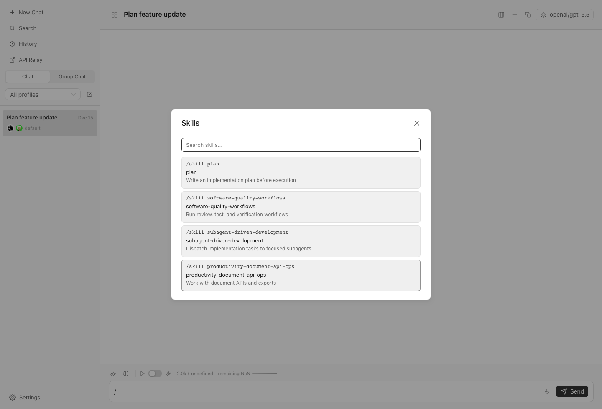
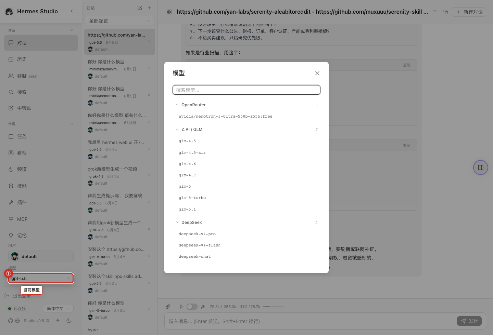

# Chat and Sessions

The Chat and Sessions area is your primary workspace for interacting with models, managing active conversations, and leveraging local context through files and terminals.

## What you can do here
* Start a new conversation or continue an existing session.
* Switch models before sending a message.
* Use Markdown and tool output rendering to review structured responses.
* Open related files or a terminal drawer when a task needs local context.
* Search across current work and jump to relevant sessions.

## Typical workflow
Begin by opening a new chat or selecting an active session from your history. Choose the most appropriate model for your task using the model selector. As you chat, you can open the files drawer to reference project documents or the terminal drawer to execute local commands. Use the search functionality to quickly find specific conversations or details within your active work.

## Key controls
* **Model Selector:** Change the active AI model before sending your prompt.
* **Message Input:** Compose messages with support for Markdown.
* **Skill Command Picker:** Type `/skill` from chat to browse and insert available skill commands.
* **Files Drawer Toggle:** Open a panel to view and interact with local files.
* **Terminal Drawer Toggle:** Access a command-line interface alongside your chat.
* **Search Bar:** Find sessions and content across your workspace.

## Screenshots
* 
* 
* 
* 
* 

## Current chat behavior

Chat navigation is designed to remain clear even during long sessions. Sidebars and history loading controls help you maintain context, while thinking states display a dedicated indicator and toolbar layout. The chat input also includes a skill command picker, allowing you to discover and insert available skill commands directly into the conversation.

## Notes and limits
* Model changes usually affect the next turn, not past answers.
* Terminal and file drawers can expose or modify local data; use them deliberately.

## Related pages
* [History and Search](04-History-and-Search.md)
* [Files and Workspaces](10-Files-and-Workspaces.md)
* [Web Terminal](15-Web-Terminal.md)
