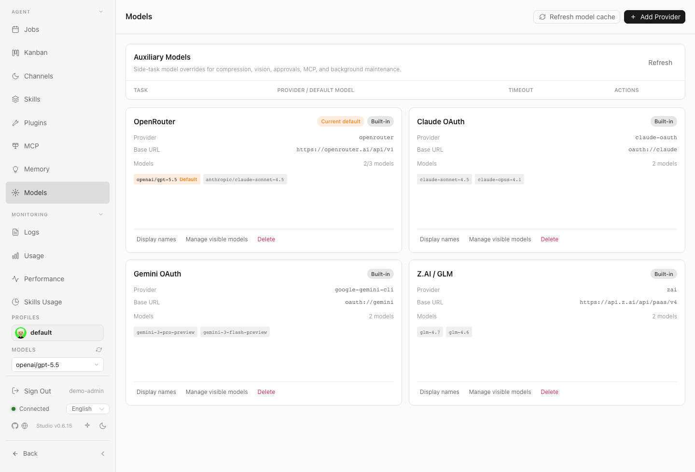
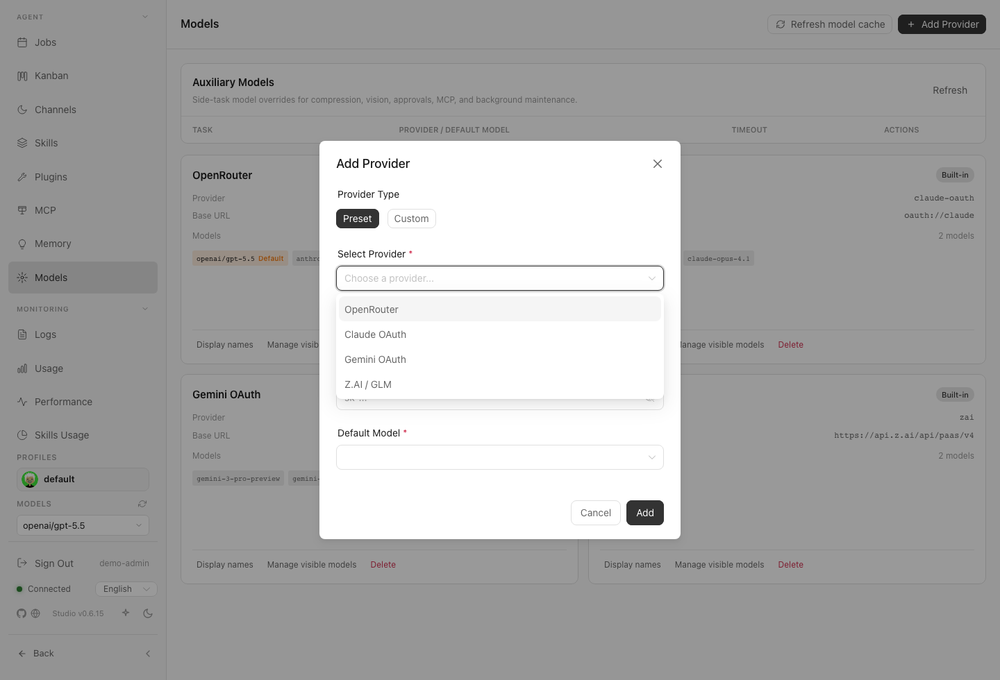
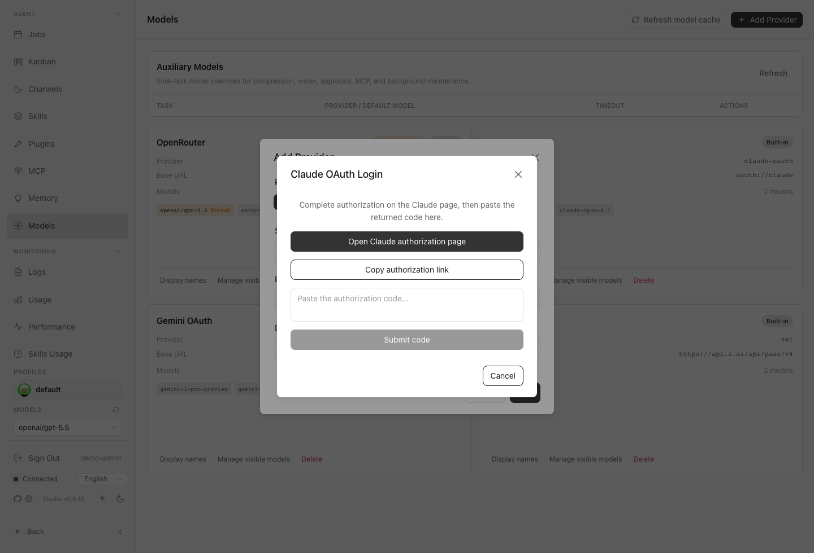

# Models and Providers

The Models and Providers section lets you configure external AI services, manage credentials, and select the specific models that power your chat experience.

## What you can do here
* Review configured providers and available models.
* Add or adjust custom provider entries when supported.
* Choose defaults and aliases used by the chat experience.
* Check whether provider authentication appears ready.

## Typical workflow
Start by navigating to the providers list to ensure your desired services are connected. If a provider is missing, add it using the configuration modal and supply the necessary credentials. Once configured, review the list of available models, set your preferred default model, and assign aliases if needed. Check the connection status to verify that the models are ready for use in chat.

## Key controls
* **Provider List:** View and manage your connected AI services.
* **Refresh Model Cache:** Reload provider model catalogs after config.yaml or provider changes.
* **OAuth Provider Picker:** Add Claude or Gemini OAuth-backed providers without pasting API keys into the form.
* **Add Provider Button:** Open the modal to configure a new service connection.
* **Model Configuration:** Set defaults, aliases, and visibility for specific models.
* **Status Indicators:** Verify authentication and connection health.

## Screenshots
* 
* 
* 
* 
* 
* 

## Current provider behavior

The application supports OAuth provider flows for both Claude and Gemini, and it reliably normalizes Gemini model IDs. Additionally, model selectors can refresh configuration changes on the fly without requiring a full interface restart. If a model or provider appears stale, refresh the model and config views before adjusting your credentials.

## Notes and limits
* Provider credentials are sensitive. Do not expose tokens in screenshots, chat, or issue reports.
* If a model is missing, check provider configuration, credentials, visibility settings, and server logs.

## Related pages
* [Settings and Security](14-Settings-and-Security.md)
* [Troubleshooting](19-Troubleshooting.md)
