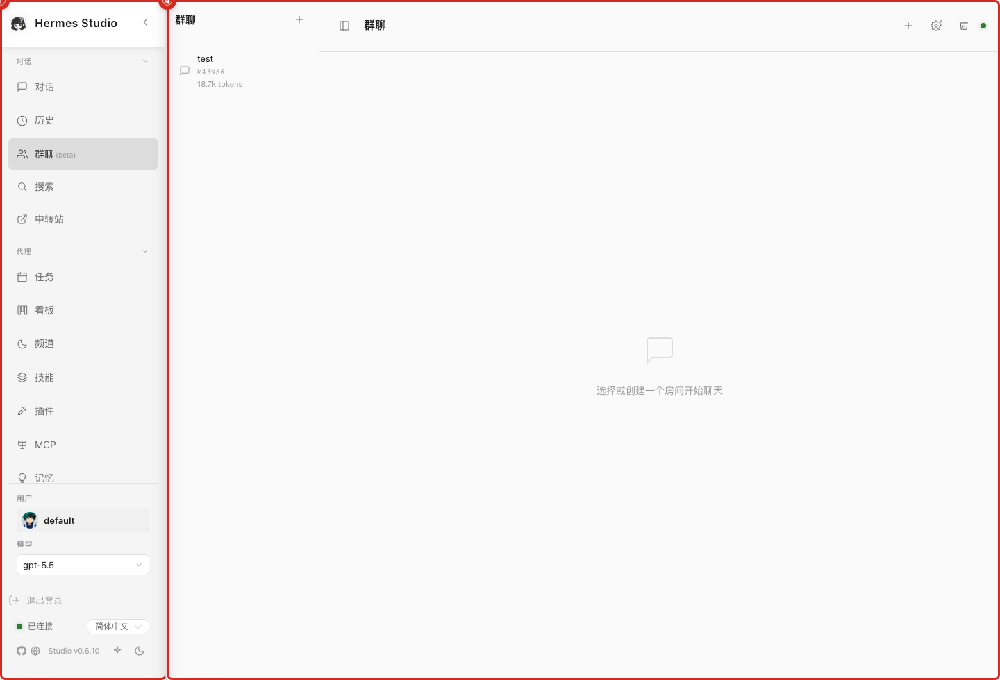
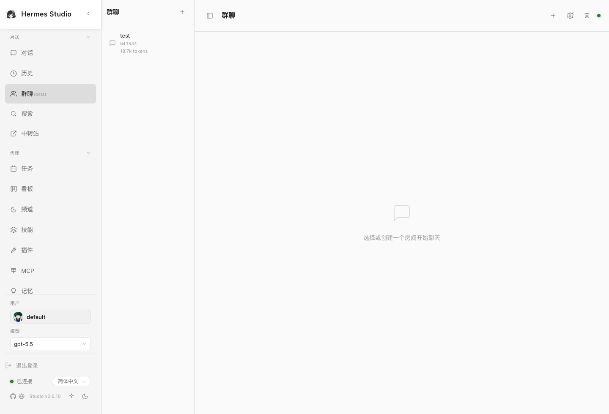

# Group Chat

Group Chat provides a collaborative space where multiple participants, including different agents or configured users, can interact in a shared environment.

## What you can do here
* Create and open group chat rooms.
* Add or review room members.
* Mention participants to direct a question or task.
* Watch message flow and participant status.

## Typical workflow
Start by creating a new group chat room or opening an existing one. Review the current members to ensure all necessary participants are present. Add new members if required. During the conversation, mention specific participants to assign tasks or direct questions, and monitor the overall flow of messages and status updates within the room.

## Key controls
* **Room List:** Browse and access active or archived group chats.
* **Create Room Button:** Start a new collaborative session.
* **Participant Management:** Add or remove members from the room.
* **Mention Syntax:** Direct communication to specific participants within the chat.

## Screenshots
* 
* 

## Notes and limits
* Multi-agent rooms are only as useful as their configured members and runtime availability.
* Do not put secrets in group chat unless every configured participant and channel is appropriate for that data.

## Related pages
* [Chat and Sessions](03-Chat-and-Sessions.md)
* [Coding Agents, Global Agent, and MCP](16-Coding-Agents-Global-Agent-and-MCP.md)
