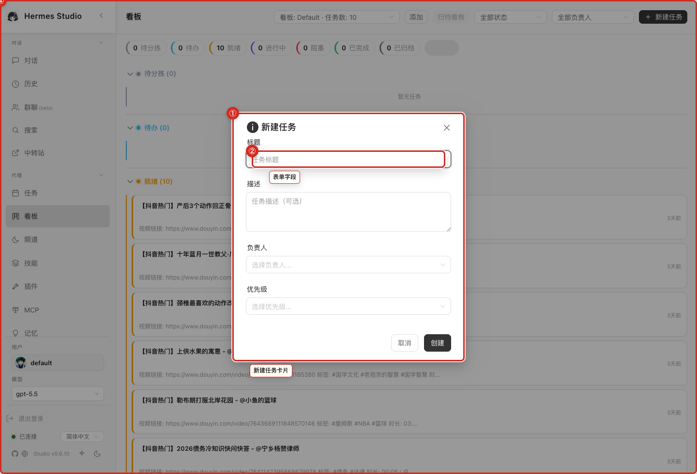

# Kanban

The Kanban board offers a visual operational overview, allowing you to organize, track, and update the status of ongoing work items and tasks.

## What you can do here
* View tasks by status column.
* Create new tasks with enough context to execute.
* Open task details and update status.
* Use the board as an operational overview for ongoing work.

## Typical workflow
Begin your session by reviewing the board to check the status of ongoing tasks across different columns. When starting a new piece of work, create a task and fill in sufficient context for execution. As progress is made, open the task details to update notes and drag the task to the appropriate status column until it is completed.

## Key controls
* **Board View:** Organize and view tasks by columns (e.g., Todo, In Progress, Done).
* **New Task Button:** Create a new work item with details and context.
* **Task Card:** Click to open, edit, and review task specifics.
* **Drag and Drop:** Move tasks across columns to update their status.

## Screenshots
* 
* 

## Notes and limits
* Kanban is a coordination tool; it does not replace verification. Mark work complete only after the result is checked.

## Related pages
* [Chat and Sessions](03-Chat-and-Sessions.md)
* [Jobs and Cron](09-Jobs-and-Cron.md)
