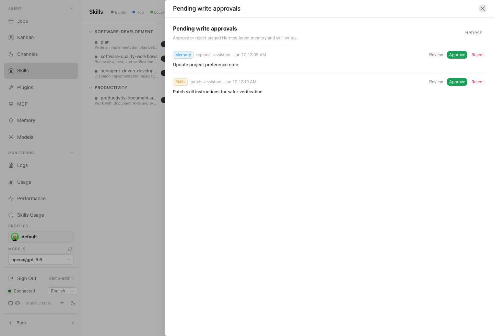
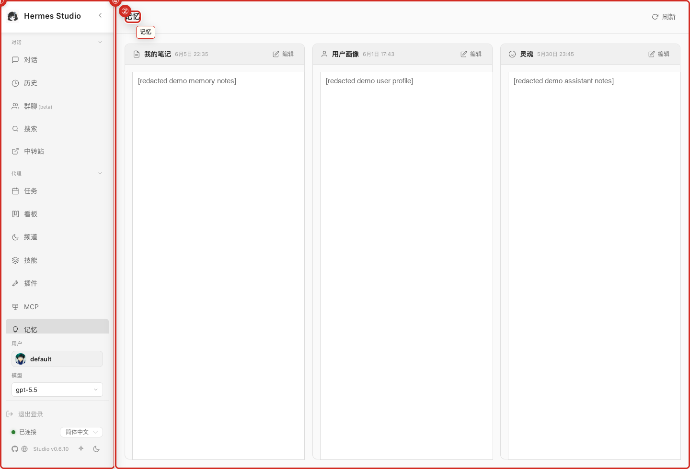
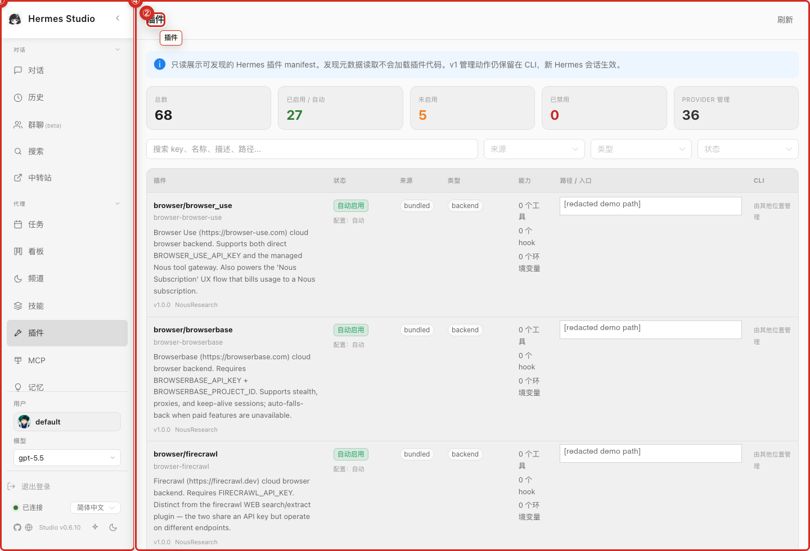

# Skills, Memory, and Plugins

Skills, Memory, and Plugins form the extensible core of the assistant, allowing you to view taught procedures, inspect stored context, and review available integrations.

## What you can do here
* Browse available skills and read skill details.
* Review memory or notes exposed through the UI.
* Inspect plugin inventory and availability.
* Use skills as reusable procedures for recurring tasks.

## Typical workflow
Before starting a complex recurring task, check the skills list to see if a relevant procedure is already available. If you need to verify what the assistant remembers about your preferences or past tasks, open the memory view. To expand capabilities, browse the plugin inventory to see which integrations are active and ready to assist you.

## Key controls
* **Skills List:** Browse, search, and review available procedural skills.
* **Pending Write Approvals:** Review staged memory and skill writes before approving or rejecting them.
* **Memory View:** Inspect stored facts, notes, and learned context.
* **Plugin Inventory:** See active integrations and their status.

## Screenshots
* 
* 
* 
* 

## Current skills and memory behavior

The chat input surfaces available skill commands through an integrated command picker, making reusable workflows easy to discover while composing a prompt. Additionally, skills and memory writes generate pending write approvals. Always review these approvals before accepting changes, as they directly affect future assistant behavior.

## Notes and limits
* Memory and skills can influence future assistant behavior. Treat personal, credential, or project-sensitive entries carefully.

## Related pages
* [Chat and Sessions](03-Chat-and-Sessions.md)
* [Jobs and Cron](09-Jobs-and-Cron.md)
