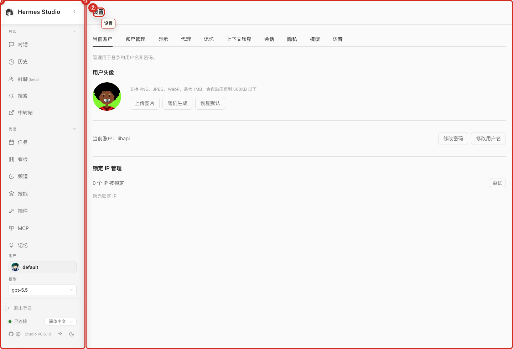
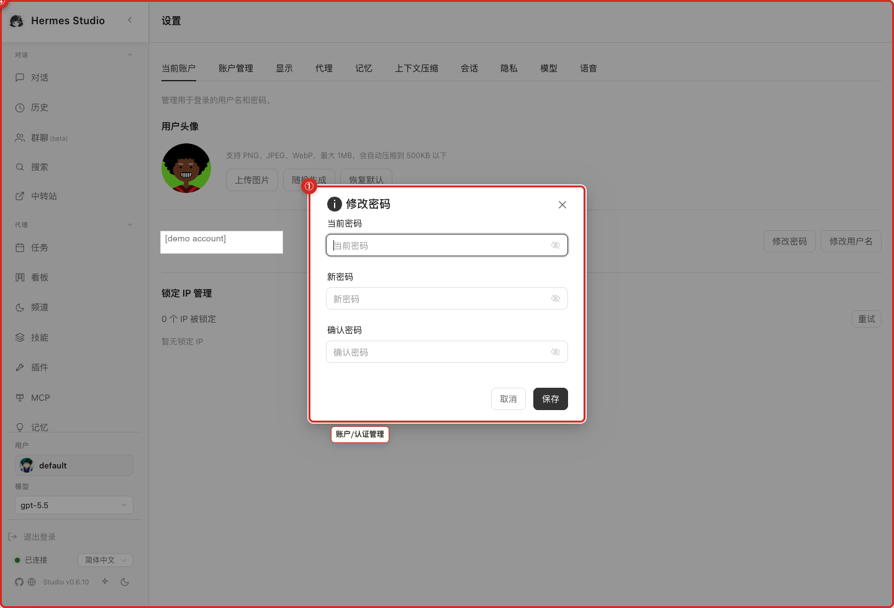

# Settings and Security

Settings is where you adjust how the web UI behaves and how sensitive features are exposed. Use it for account preferences, display choices, memory/session behavior, voice-related options, and security controls that affect access or data handling.

## What you can do here

- Adjust account and display preferences.
- Review privacy, memory, and session-related settings.
- Configure voice or speech-related options when available in your installation.
- Understand which settings may affect credentials, retention, or external integrations.

## Typical workflow

1. Open Settings and choose the section that matches the change you want to make.
2. Review the current value before editing it.
3. Change one setting at a time when troubleshooting.
4. Save the change, then re-test the related workflow such as chat, voice, sessions, or channel delivery.
5. If the change affects credentials, memory, jobs, or external channels, confirm that the result is expected before continuing work.

## Key controls

| Control | Use it for |
| --- | --- |
| Account settings | Review user-facing account details and account-level actions. |
| Display preferences | Adjust how the interface looks and behaves for daily use. |
| Privacy and memory settings | Control data retention, memory exposure, and session-related behavior. |
| Voice settings | Configure speech or voice features when the deployment supports them. |
| Security settings | Protect access, credentials, and sensitive operational behavior. |

## Screenshots

## Current settings behavior

Display controls and form readability provide a clear visual experience, including well-defined dark-theme borders across inputs and selects. Completion notifications alert you to finished runs in supported desktop or browser environments. Additionally, write-gate controls require explicit approval before sensitive memory or skill changes can take effect.

## Notes and limits

- Settings can affect security, retention, and external integrations. Avoid changing multiple unrelated settings at once when troubleshooting.
- Do not share screenshots that show credentials, account details, private profile names, webhook URLs, or other sensitive configuration.
- If a setting changes how jobs, channels, memory, or providers behave, test the smallest related workflow before relying on it.

## Related pages

- [Profiles](06-Profiles.md)
- [Models and Providers](05-Models-and-Providers.md)
- [Channels and Gateways](13-Channels-and-Gateways.md)
- [Troubleshooting](19-Troubleshooting.md)
