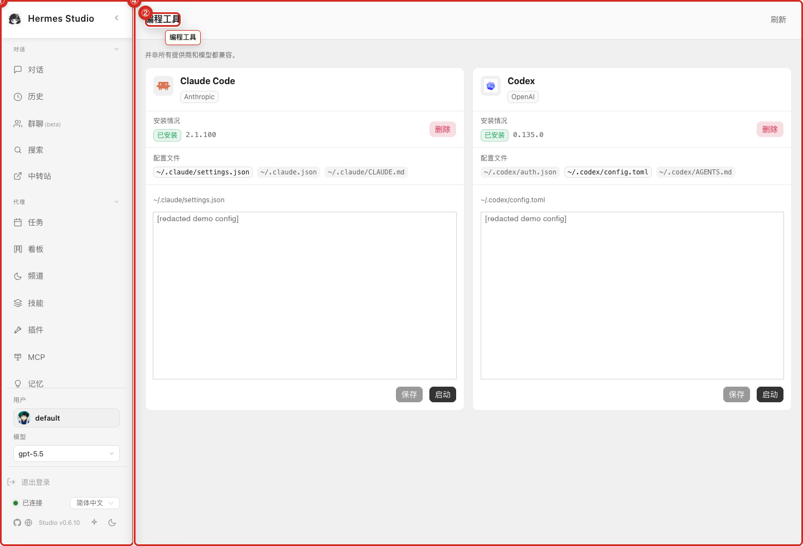
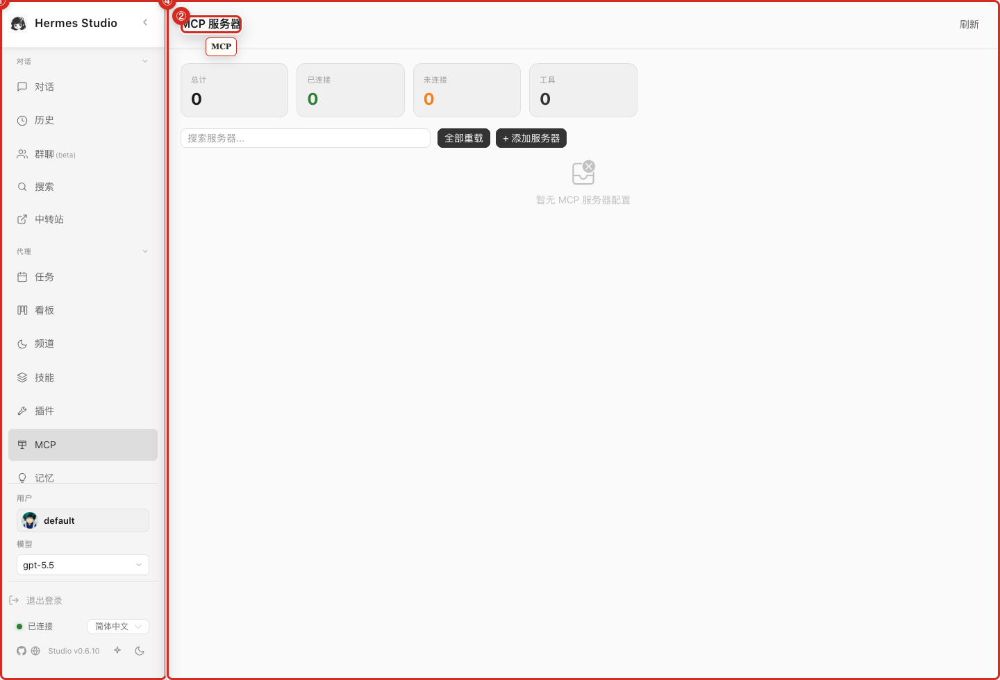
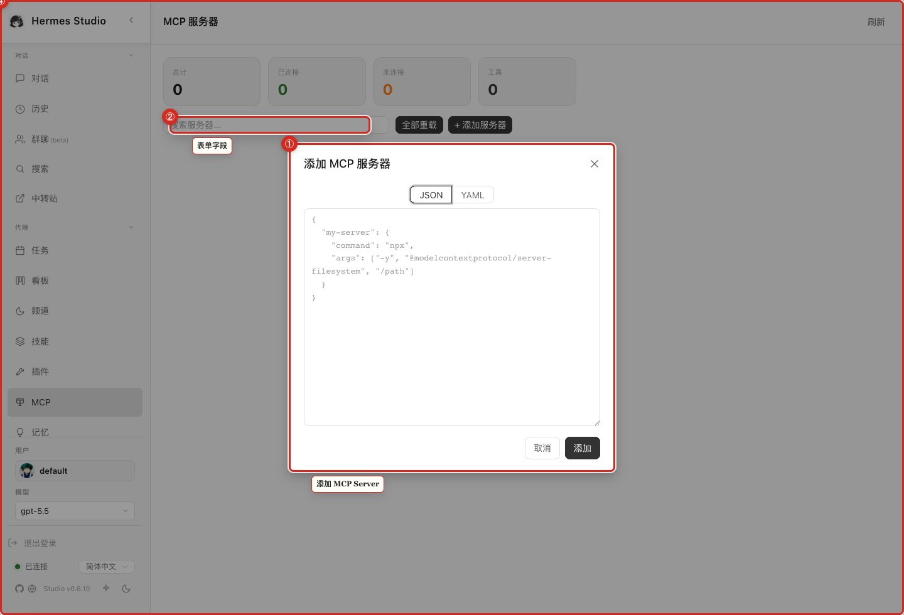

# Coding Agents, Global Agent, and MCP

This section manages advanced automated assistants, including coding agents and Global Agent sessions, and configures external capabilities through Model Context Protocol (MCP) servers.

## What you can do here
* Start or review coding-agent runs.
* Open Global Agent sessions.
* Add, inspect, or manage MCP servers.
* Check available tools before asking an agent to use them.

## Typical workflow
Before asking an agent to handle a complex task, ensure your required MCP servers are active. Start a coding agent or Global Agent session with a clear prompt, then monitor its progress and tool usage. If the agent lacks a required capability, verify your MCP configuration.

## Key controls
* **Agents Dashboard:** View active and completed agent sessions.
* **MCP Server Management:** Add, edit, or remove Model Context Protocol servers.
* **Session Controls:** Start, stop, or pause agent execution.
* **Available Tools List:** Review capabilities exposed to active agents.

## Screenshots
* 
* 
* 

## Current agent behavior
Coding agent workflows provide stable sessions with visible queue and reasoning states, ensuring tool interactions and final outputs are preserved. For desktop users, the app detects Claude Code by inspecting your shell PATH and common package manager locations. If a connection bridge fails, the system captures the error tail to help troubleshoot.

## Notes and limits
* MCP/advanced runtime tools may be restricted to administrative accounts.
* Advanced agent tools can read files, run commands, call external services, or modify your workspace. Use narrow instructions and review the results.

## Related pages
* [Chat and Sessions](03-Chat-and-Sessions.md)
* [Group Chat](07-Group-Chat.md)
