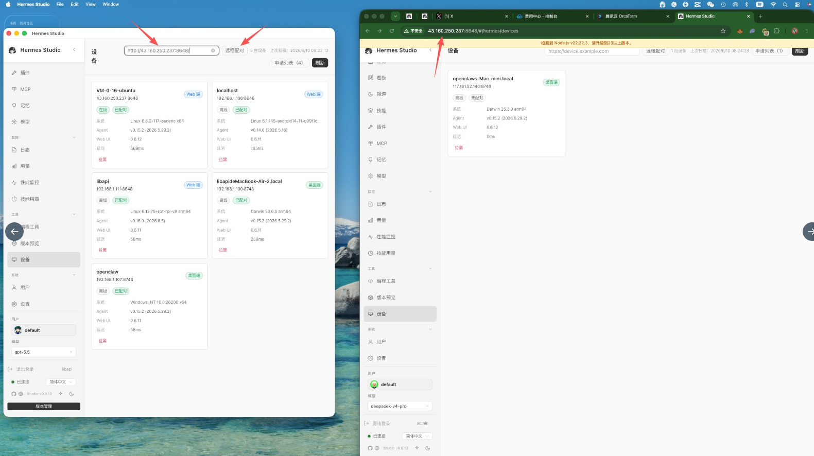
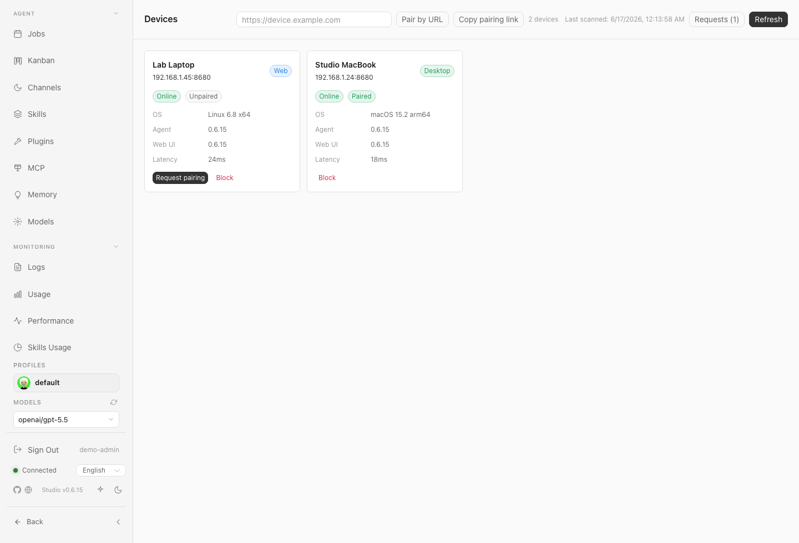
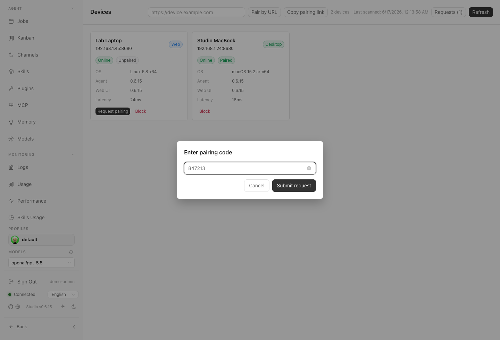
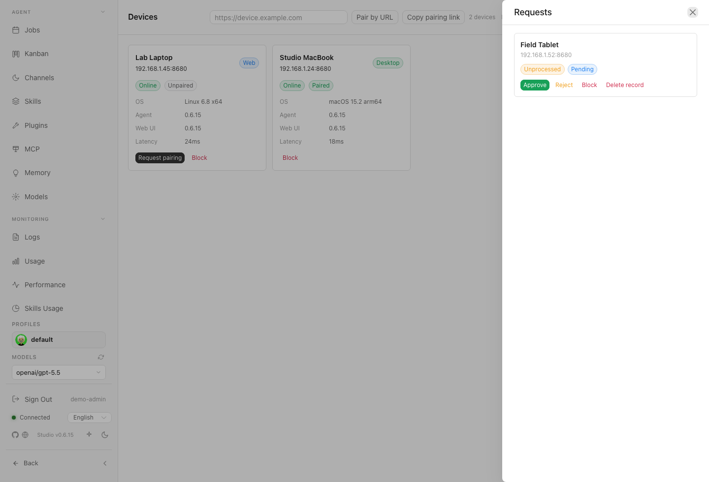
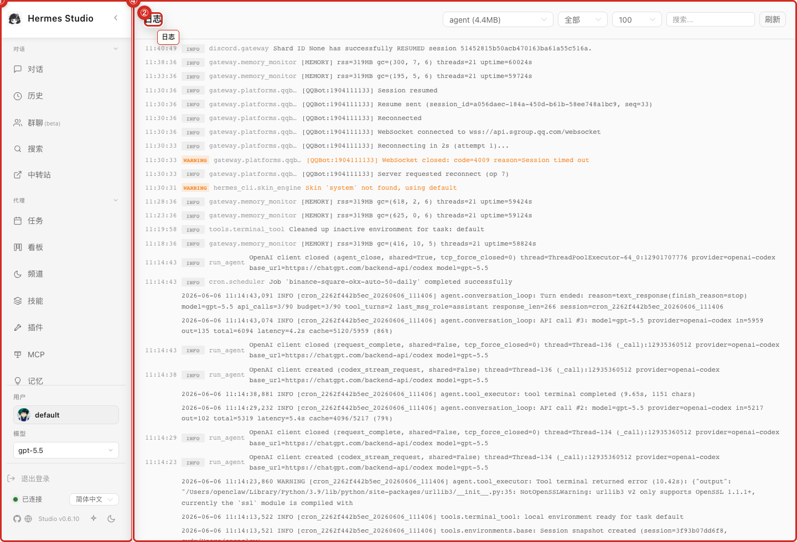

# Devices, Version, and Logs

Monitor system health, manage connected hardware, and review runtime logs or software versions.

## What you can do here
* Inspect devices discovered on the LAN.
* Pair this machine with another trusted device.
* Review inbound pairing requests (approve, reject, or block).
* Check the current release and pending desktop updates.
* Open logs to diagnose runtime failures.

## Typical workflow
Start with **Refresh** to scan the LAN. If automatic discovery misses the target machine, use **Pair by URL** with the target's pairing URL. Provide the target's current pairing code to request access. After the target approves the inbound request, verify its card shows **Online** and **Paired** before relying on it for MCP or remote-device workflows.

## Key controls
* **Devices List:** View discovered or paired machines (online status, OS, versions, response time).
* **Refresh:** Scan the LAN for discoverable devices.
* **Copy Pairing Link:** Get this machine's link so another device can request access.
* **Pair by URL:** Paste another device's pairing URL if LAN discovery fails.
* **Requests:** Manage inbound pairing requests (approve, reject, block, unblock, or remove history).
* **Version Info:** Check your current release and pending updates.
* **Logs Viewer:** Read, search, and filter real-time system logs.

## Connect another device
1. Click **Refresh** to scan the LAN. If the target isn't found, get its pairing link and use **Pair by URL**.
2. Enter the target device's current pairing code (generated per-start).
3. On the target machine, open **Requests** to approve the inbound request.
4. Ensure the device card shows **Online** and **Paired** before using it in workflows.

## Screenshots
* 
* 
* 
* 
* 
* 

## Current device and version behavior
Device pairing uses per-start pairing codes, throttles connection requests, and requires approval while preserving LAN discovery for trusted networks. The Devices page serves as the trust management surface; remote actions occur through MCP or remote-device tools once paired. Version-management handles desktop self-updates and uses clean shutdown behavior to reduce stale background processes.

## Notes and limits
* Only pair with explicitly trusted devices on your network.
* Pairing approval grants trust; reject or block unknown requests immediately.
* Version-management controls may be admin-restricted.
* Logs may expose sensitive data like local paths, profile names, or error details. Review carefully before sharing.

## Related pages
* [Troubleshooting](19-Troubleshooting.md)
