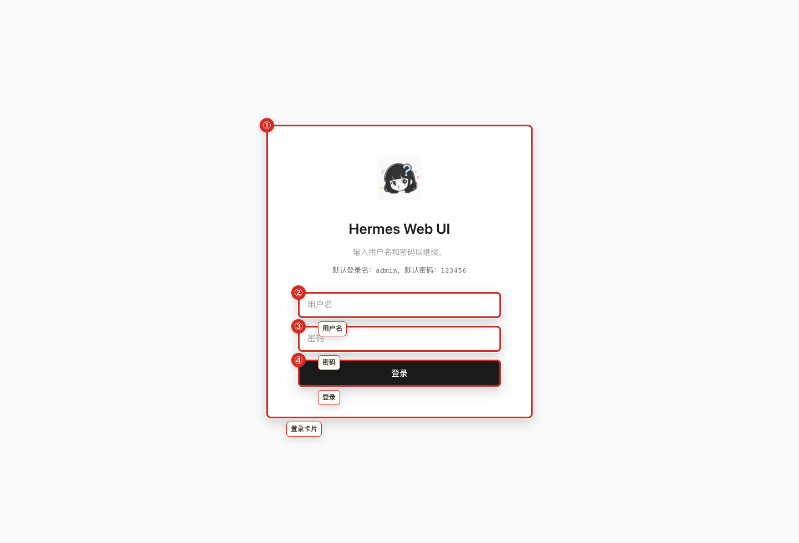
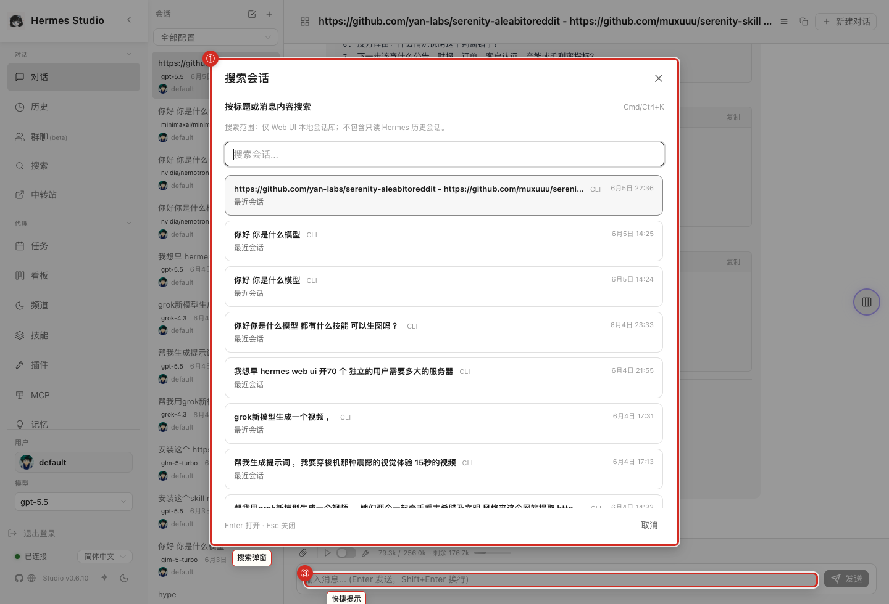
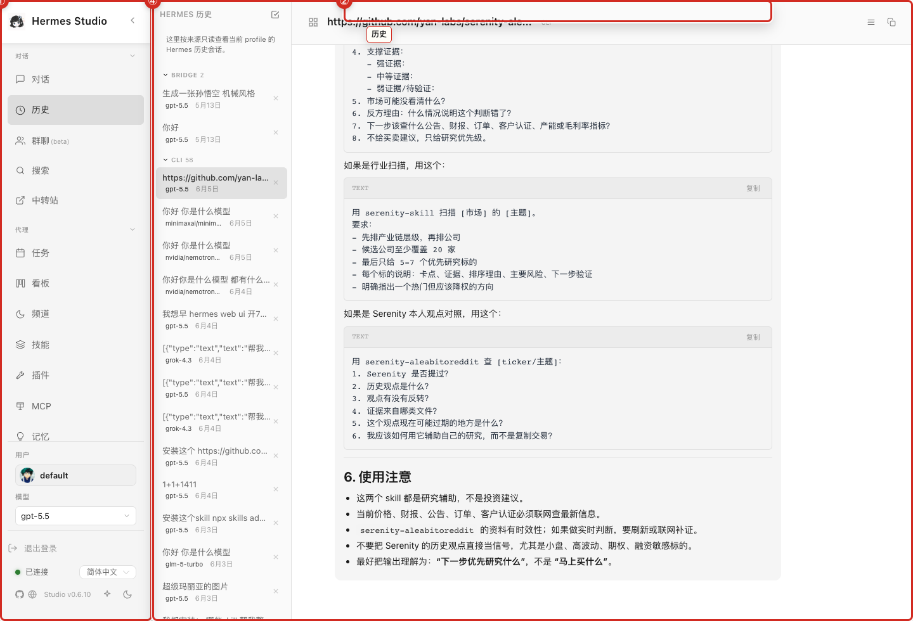
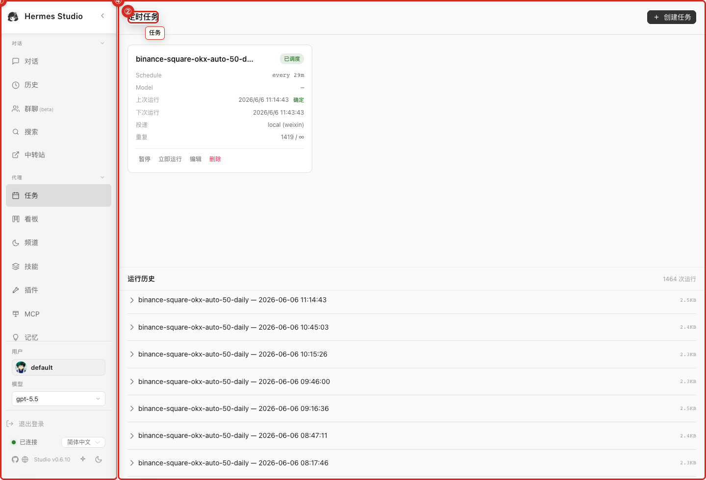
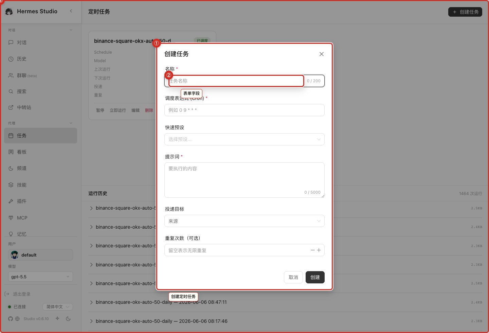
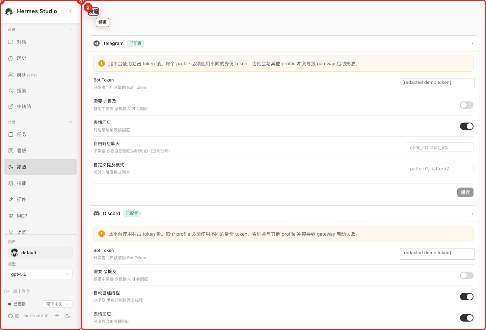
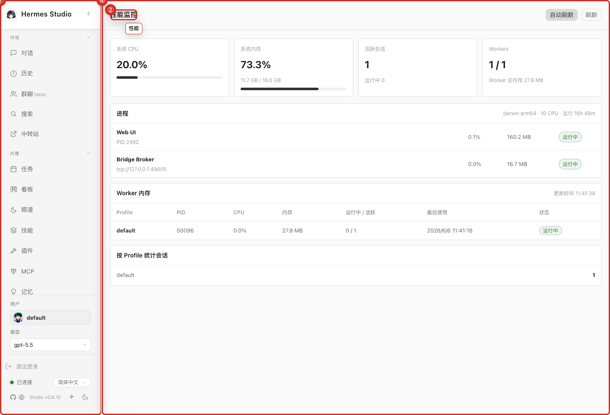
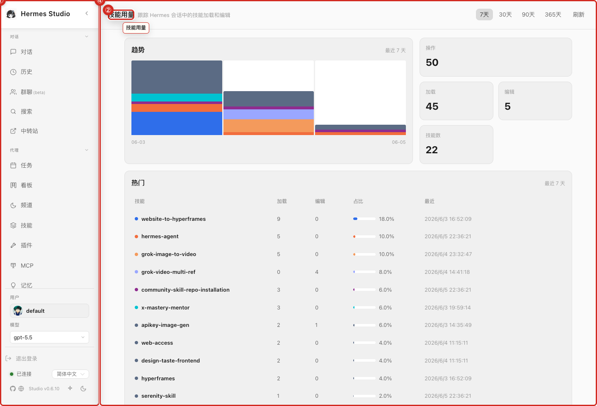
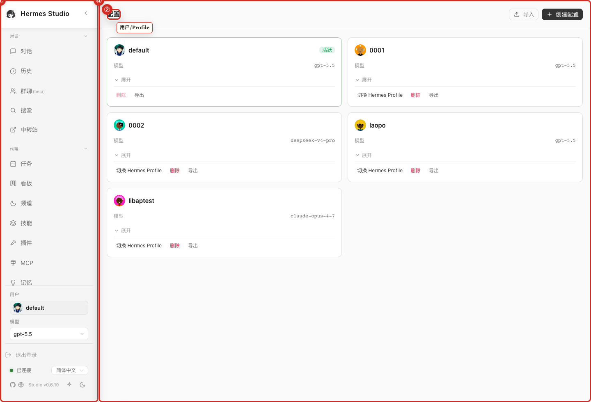

# Screenshot Gallery

This gallery provides a complete visual reference of the application's interface.

## What you can do here
* Browse all manual screenshots in a single view.
* Map screenshot filenames to specific product areas.
* Reference interface elements during reviews or support sessions.

## Screenshots
* 
* 
* 
* 
* 
* 
* 
* 
* 
* 
* 
* 
* 
* 
* 
* 
* 
* 
* 
* 
* 
* 
* 
* 
* 
* 
* 
* 
* 
* 
* 
* 
* 
* 
* 
* 
* 
* 
* 
* 

## Notes and limits
* The screenshot gallery uses demo/manual screenshots. Treat any visible data as example content.
* Sensitive-looking demo values such as bot-token fields, account names, local paths, and memory bodies were redacted before publication.

## Related pages
* [Interface Overview](02-Architecture.md)
